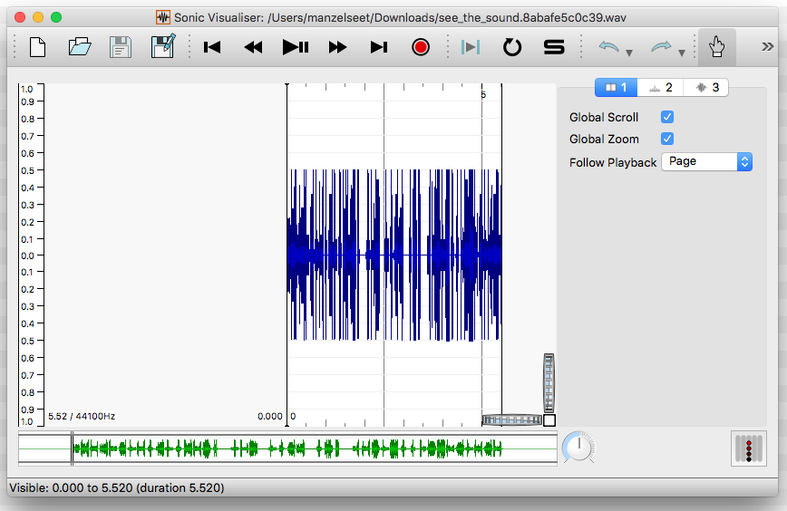
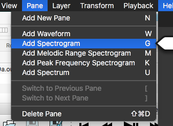
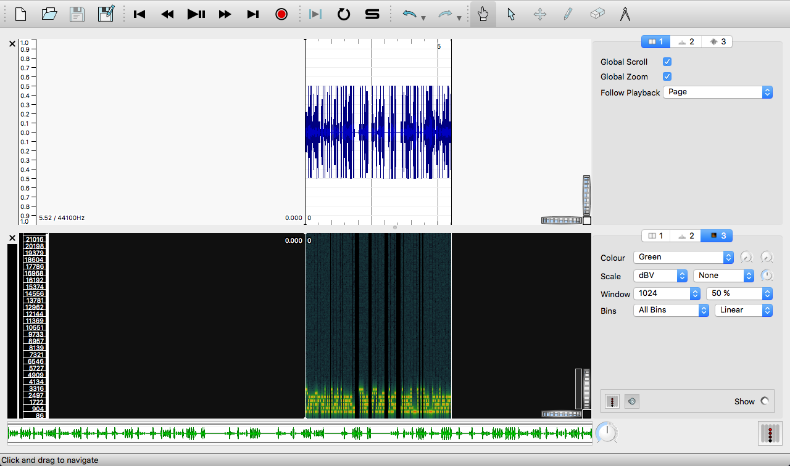
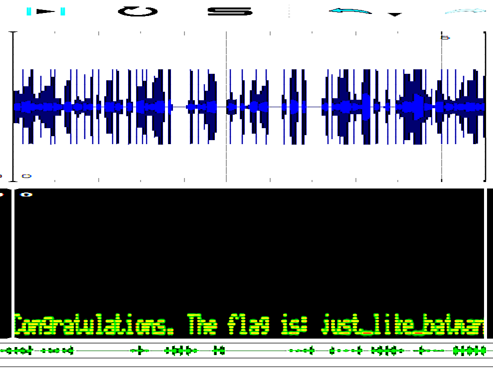

# Synesthesia

### Challenge
> Yatharth just dropped his **fire** new mixtape, but the last track is somewhat of a mystery. It’s called ‘See the Sound,’ and no one really knows what to make of it.

> [seethesound.wav](seethesound.wav)

### Hint
> Look at it!

### Solution
The name of the file and the hint tells us that we have to literally look at the wav file. 
Immediately, I think of visualisation. Searching online leads me to think [Lifehacker article](http://lifehacker.com/5807289/how-to-hide-secret-messages-and-codes-in-audio-files).

> To decode the message, open it in Sonic Visualizer. You'll see the audio spectrum but not the message. To view the message, go to the Layout menu and choose "Add Spectrogram" (any of the options in the submenu should be fine). You may need to adjust the way you're viewing it, but you should now be able to see your hidden message.

So we need to download [Sonic Visualizer](http://www.sonicvisualiser.org/). Open the file in Sonic Visualizer

Next, we need to *Add Spectrogram*

This reveals the message!

However, it is still not so visible, so let's increase the contrast and stretch it horizontally by 400%

Thus, the flag is `just_like_batman`